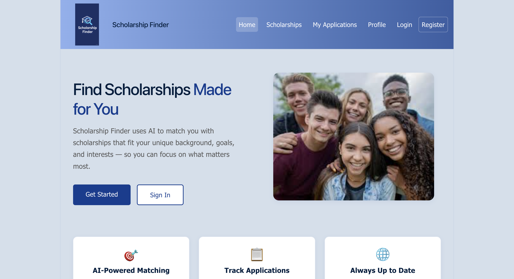
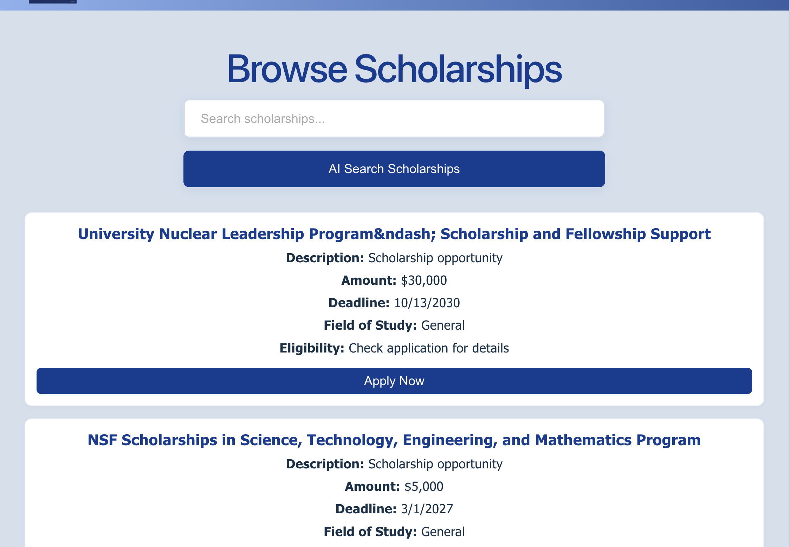
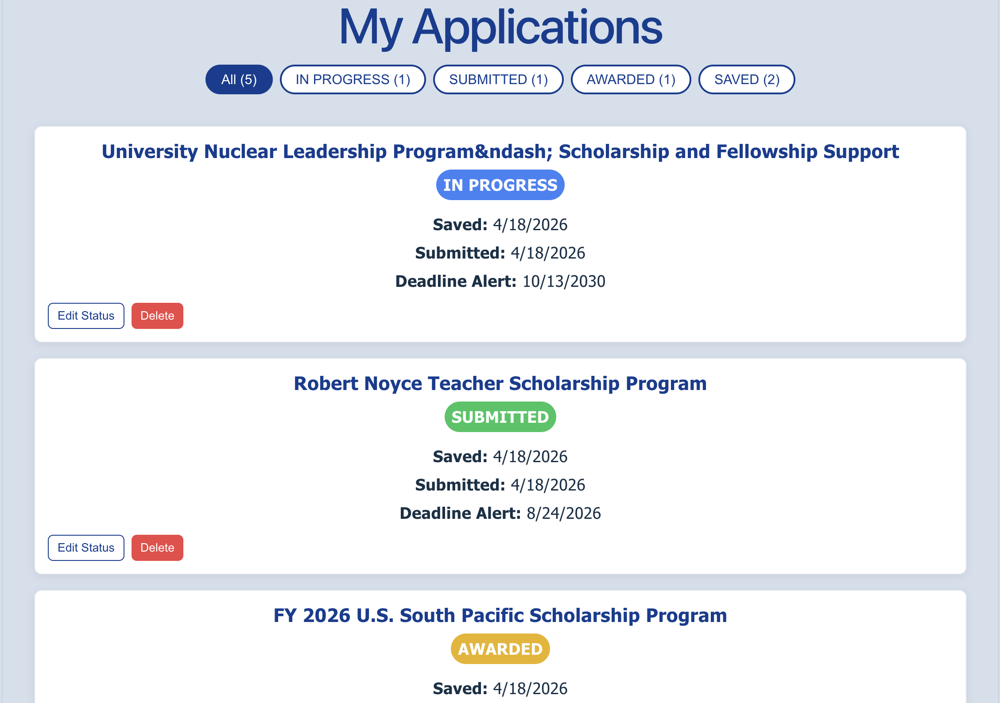
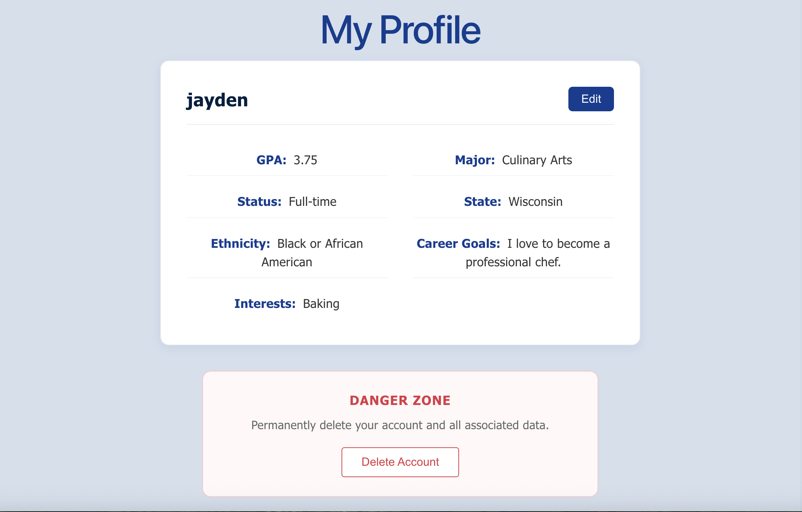

# Scholarship Finder

*Find the funding you actually qualify for — powered by AI.*

---

## The Team

Jayden Andrews  
James Barclay  
Lan Nguyen  

---

## Description of the App

**Scholarship Finder** is a full-stack web application designed to simplify the scholarship discovery process using AI-powered matching.

For many students, finding financial aid is overwhelming due to scattered resources and complex eligibility requirements. This platform centralizes scholarship opportunities and uses intelligent matching to connect students with funding they are most likely to qualify for.

By combining structured scholarship data with personalized student profiles, the app transforms a fragmented and time-consuming search process into a streamlined, data-driven experience.

### Key Features

- AI-powered personalized scholarship matching  
- Searchable and filterable scholarship directory  
- Deadline-aware prioritization of opportunities  
- Application tracking system  
- Continuous surfacing of new relevant opportunities  

---

## Demo

https://26q1-team5-capstone.vercel.app/


---

## Installation Instructions

### Prerequisites

- Java 17+  
- Maven  
- Node.js  
- PostgreSQL  
- AI API key (optional, limited usage due to token constraints)

---

### Backend Setup

```bash
cd backend
mvn clean install
mvn spring-boot:run
```

---

### Frontend Setup

```bash
cd frontend
npm install
npm run dev
```

---

### Environment Variables

Create an `application.properties` file (or use environment variables):

```properties
ai.api.key=YOUR_API_KEY
spring.datasource.url=YOUR_DB_URL
spring.datasource.username=YOUR_DB_USER
spring.datasource.password=YOUR_DB_PASSWORD
```

Note: AI matching features may be limited due to API token constraints.

---

## System Overview

### Core Entities

- User – authentication and account management  
- Profile – student data used for AI matching  
- Scholarship – funding opportunities  
- Application – tracks user progress  

---

### AI Matching Flow

1. Retrieve user profile  
2. Fetch scholarship opportunities  
3. Construct AI prompt with profile + opportunities  
4. Send request to AI service  
5. Parse results and extract matches  
6. Rank by fit score and deadline priority  

---

## Screenshots

## Screenshots

<p align="center">
  
  
</p>
<p align="center">
  
  
</p>

---

## Known Issues

- Limited AI API token availability can restrict matching functionality  
- No fully comprehensive public scholarship API; data may be incomplete  
- Some opportunities may lack detailed eligibility information  
- Real-time updates depend on external data refresh cycles  
- Environment configuration can be error-prone during deployment  

---

## Roadmap Features

- Improve AI matching accuracy with optimized prompt engineering  
- Expand scholarship data ingestion and normalization
- Allow user to create custom applications
- Add notifications for deadlines and new matches  
- Enhance mobile responsiveness  

---

## Credits

Built as part of the Code Differently Capstone Program  
Data provided by Grants.gov  
Technologies used:
  - Spring Boot  
  - React  
  - PostgreSQL
  - Claude AI API (limited usage due to token constraints)  